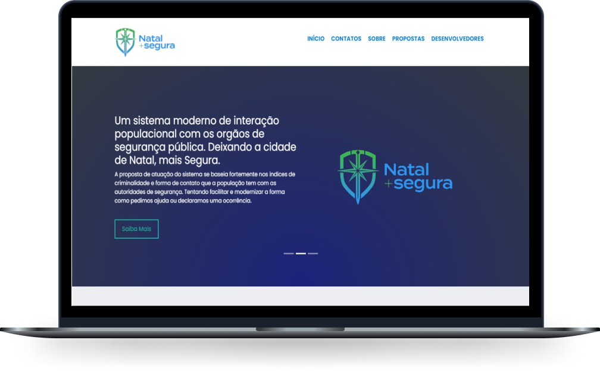

<h1 align="center">
  
</h1>

<a href="#-sobre">Sobre</a>&nbsp;&nbsp;&nbsp;|&nbsp;&nbsp;&nbsp;
  <a href="#-tecnologias">Tecnologias</a>&nbsp;&nbsp;&nbsp;|&nbsp;&nbsp;&nbsp;
  <a href="#-projeto">Projeto</a>&nbsp;&nbsp;&nbsp;|&nbsp;&nbsp;&nbsp;
  <a href="#-licença">Licença</a>&nbsp;&nbsp;&nbsp;

 

  
  

## 📂 Sobre

Como modo de solucionar e auxiliar a segurança natalense, o projeto Natal + Segura consiste em implementar duas plataformas, uma mais simples e voltada para dispositivos móveis e outra mais trabalhada, sendo um site responsivo.

A primeira plataforma consiste em um aplicativo mobile, com a funcionalidade de configurar um botão de pânico que entraria em contato rápido com as forças de segurança disponíveis na cidade como a policia militar, SAMU, corpo de bombeiros e a delegacia da mulher, para que a unidade mais próxima fosse direcionada ao local fazendo um contato direto e simples da população com as autoridades competentes.

## 🚀 Tecnologias

Esse projeto foi desenvolvido com as seguintes tecnologias:

- Web
  - HTML 5 ✔
  - CSS 3 ✔
  - JavaScript ✔
- Mobile
  - Não desenvolvido.

*Aplicativo ainda em produção.

##  📌Projeto

### 📱 Mobile

O aplicativo mobile conta com a execução de disposições de diversas funcionalidades do telefone celular. Desenvolvido de uma forma acessível e dinâmica pensada para o acesso a todos os natalenses o mesmo foi projetado para, com relação ao sistema Android, funcionar a partir do 5.1.1 Lollipop em sua versão estável.

Sua interface é simples. Assim que o usuário baixar e abrir pela primeira vez o aplicativo o mesmo irá mostrar a tela com um formulário a ser preenchido.

 

  

O usuário deverá preencher todos os campos disponíveis e permitir o acesso do app a alguns sistemas nativos como a localização e o Armazenamento. Após todo esse processo, o usuário será direcionado pelo aplicativo para sua tela inicial.

Na tela inicial conta com uma seção de botões com quatro botões de pânico principais de chamado contendo SAMU, CBMRN, PMRN e a DEAN. Ao clicar o mesmo aciona o serviço referente ao botão que envia todas as informações do usuário que foram preenchidas no formulário juntamente com sua localização atual. Logo a baixo temos uma seção com os telefones emergenciais disponíveis, para também serem utilizados.

 

  
  

  Na barra superior do aplicativo onde encontra-se a logo temos també um menu que serve para acessar algumas informações a mais sobre o aplicativo. Permitindo o usuário editar suas informações, verificar as configurações de privacidade do aplicativo bem como ler sobre os termos de uso, configurações de acessibilidade para deficientes visuais e um acesso rápido ao site que faz ligação entre plataformas do sistema. 
  
  Outra funcionalidade, sendo a principal do menu, é de configuração de um acesso mais rápido. O usuário pode configurar um comando especifico em seu celular para acionar algum dos botões de pânico do aplicativo. Por exemplo, se ele quer que ao apertar três vezes seguidas no botão de Power (liga/desliga) do smartphone ele quer que a SAMU seja chamada, ele pode configurar isso por meio desse local.

  

### 💻 WEB

O site irá manter o mesmo contato direto com forças de segurança e a adição do contato com a Companhia Energética do Rio Grande do Norte (COSERN), visto que em um experimento realizado por pesquisadores do Bureau Nacional de Pesquisa Econômica, em parceria com a polícia de Nova York, foi identificado que, ao manter iluminação pública extra em quarenta ruas consideradas perigosas, observaram uma diminuição de 36% nos crimes noturnos nessas localidades. Mais uma adição, é uma aba de denúncias, na qual a população poderá informar sobre crimes ou alertas de áreas de risco. Outra funcionalidade, voltada à informação, seria a visualização das propostas políticas relacionadas à segurança, para que a população possa estar ciente das decisões dos políticos. Para finalizar, haveria também uma área de feedback da população, sobre a usabilidade do site.

  
  

O intuito do mesmo é ser informativo e funcional assim comoo o aplicativo. Tendo as mesmas funções porém com a adição de algumas outras funcionalidades sendo essas: 

<ul>
  <li>No momento do pedido de socorro, será possível duas formas de localização. Por CEP ou a loocalização geográfica atual após dar  permissão ao navegador, dependendo da preferência do usuário. Além de um campo espessífico para descrissão de informações pertinentes para ajudar as autoridades.    
  </li>
    

      
    

  <li>Modal espessífico para os telefones emergenciais com a adição de outros além dos que estão no aplicativo.</li>
    

      
    

  <li>Uma seção de explicação sobre o porquê implementar o sistema e os índices atuais de da cidade de Natal comparado com os anos anteriores para futuramente termos uma noção de funcionamento do sistema. Além disso também contamos com uma seção de divulgação das propostas mais recentes que estão sendo apresentadas na cidade com relção àa segurança.
  </li>
    

          
      
    

  </li>
  <li>Também está presente uma seção onde mmostra os desenvolvedores principais do projeto que fizeram ser possível a construção dessa tecnologia além de uma seção de comentários para os usuários do sistema sendo possível ter um feedback dos natalences.   
  </li>
  

        
    

</ul>

Clique <a href="https://ernanej.github.io/NatalMaisSegura/" target="_blank">aqui</a> para acessá-lo.

## 📝 Licença
Esse projeto está sob a licença MIT. Veja o arquivo <a href="./LICENSE">LICENSE</a> para mais detalhes.

---

Desenvolvido com ♥ by:   <a href="https://github.com/ErnaneJ">Ernane Ferreira 👋🏻</a>
<a href="https://github.com/lucasgf007">Lucas Gabriel 👋🏻</a>
<a href="https://github.com/Romisly">Romisly Domingos 👋🏻</a> 
<small>Sistema desenvolvido como projeto final da matéria de Meio Ambiente e Desenvolvimento Urbano (MADU) do curso de Ciencias e Tecnologia (C&T) na Escola de Ciências e Tecnologia da Universidade Federal do Rio Grande do Norte ECT/UFRN.<small>

